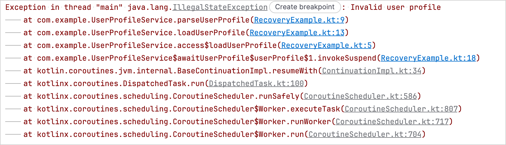
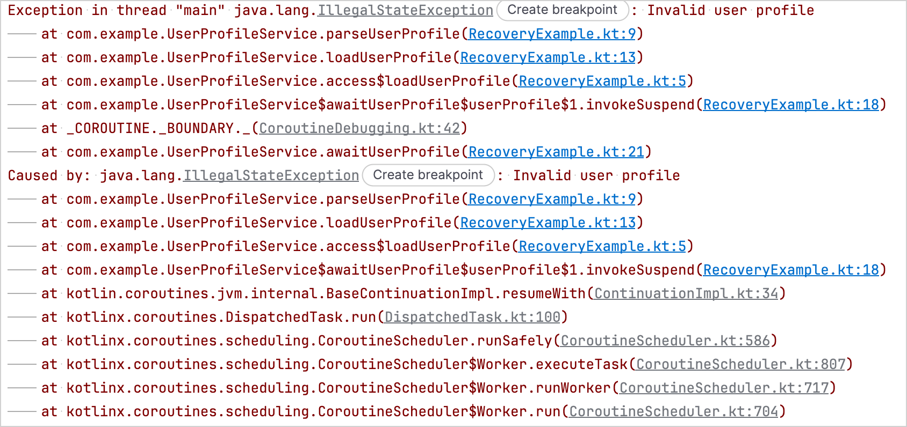

<contribute-url>https://github.com/Kotlin/kotlinx.coroutines/edit/master/docs/topics/</contribute-url>

[//]: # (title: Debugging coroutines)

Debugging applications that use coroutines can be challenging because multiple coroutines can run concurrently, suspend on one thread, and resume on another.
Their execution order and the threads they use can also change between runs, making it difficult to follow the execution of a particular coroutine.

On the JVM, you can use the following features to make debugging coroutines easier:

* [Debug mode](#enable-debug-mode) adds a unique name to each coroutine so you can identify it in a debugger and diagnostic output.
* [Stack trace recovery](#stack-trace-recovery) adds information about where an exception is rethrown or caught.
* The [debug agent](#the-debug-agent) tracks active coroutines, reports their state, and more.

Debug mode and stack trace recovery are available in the [`kotlinx-coroutines-core`](https://kotlinlang.org/api/kotlinx.coroutines/kotlinx-coroutines-core/) module.
The debug agent is available in the [`kotlinx-coroutines-debug`](https://kotlinlang.org/api/kotlinx.coroutines/kotlinx-coroutines-debug/) module.

> The debug agent isn't supported on Android.
> 
> Additionally, R8 version 1.6.0 or later disables debug mode in optimized release builds to reduce the size of the resulting binary.
> For more information, see [Optimization on Android](https://github.com/Kotlin/kotlinx.coroutines/blob/master/ui/kotlinx-coroutines-android/README.md#optimization).
>
{style="note"}

## Enable debug mode

Debug mode assigns a unique name to every launched coroutine.
You can see the name in a Java debugger, in the coroutine's string representation, and in a thread's name while it runs the coroutine.

> Debug mode has negligible runtime overhead, so you can keep it enabled to simplify logging and diagnostics.
>
{style="tip"}

To enable debug mode, pass the `-Dkotlinx.coroutines.debug` VM option in your build tool or IDE run configuration.

In IntelliJ IDEA, follow these steps to enable debug mode:

1. 1. In the **Run widget**, select the run/debug configuration you want to update, then select **More Actions** | **Edit**:

   {width="600"}

   > If you don't have a run/debug configuration, select **Current File** in the **Run widget**, then select **More Actions** | **Run with Parameters** to open the run configuration settings.
   >
   {style="note"}

2. In the **Run/Debug Configurations** dialog, enter `-Dkotlinx.coroutines.debug` in the **VM options** field:

   {width="600"}

3. Click **OK**.

Running your code with Java assertions enabled also activates debug mode automatically.

## Stack trace recovery

If a coroutine throws an exception and another rethrows it, the original stack trace doesn't show where the exception is rethrown.
The `kotlinx.coroutines` library adds this information using _stack trace recovery_, which creates a copy of the exception with additional stack frames.

When the exception is rethrown, the copy is thrown instead of the original exception, which becomes the cause of the copy.
If the original exception has suppressed exceptions, they remain attached to it instead of being copied.
This can prevent cycles in the exception chain and crashes in some frameworks.

Debug mode enables stack trace recovery by default.
To disable stack trace recovery in debug mode, pass the `-Dkotlinx.coroutines.stacktrace.recovery=false` VM option.

Here's an example that demonstrates the difference between stack traces with and without stack trace recovery:

```kotlin
import kotlinx.coroutines.*

object UserProfileService :
    CoroutineScope by CoroutineScope(CoroutineName("UserProfileService")) {

    private fun parseUserProfile(): String {
        error("Invalid user profile")
    }

    private fun loadUserProfile(): String {
        return parseUserProfile()
    }

    // Runs in the coroutine that calls this function
    suspend fun awaitUserProfile() {
        // Starts a new coroutine
        val userProfile = async(Dispatchers.Default) {
            // The new coroutine throws the exception
            loadUserProfile()
        }

        // The coroutine running awaitUserProfile()
        // receives the exception when the await() function rethrows it
        userProfile.await()
    }
}

suspend fun main() {
    UserProfileService.awaitUserProfile()
}
```

In this example, the `parseUserProfile()` function throws the exception in the coroutine started by the `.async()` builder function.
The `Deferred.await()` call in `awaitUserProfile()` rethrows it in the calling coroutine.

With stack trace recovery disabled, the stack trace doesn't show where `Deferred.await()` rethrows the exception:

{width="600"}

With stack trace recovery enabled, the stack trace also shows where the exception is rethrown:

{width="600"}

### Stack trace recovery for custom exceptions
<primary-label ref="experimental-opt-in"/>

Stack trace recovery can copy an exception automatically when its class has a public constructor that accepts a message, a cause, both, or no arguments.

If you want the `kotlinx.coroutines` library to recover the stack trace of an exception that requires additional constructor arguments,
such as a line number or an error code, implement the `StackTraceRecoverable` interface.

The `StackTraceRecoverable` interface is part of the Kotlin standard library, so you can implement it without adding a dependency on `kotlinx.coroutines`.

> The `StackTraceRecoverable` interface is available on all targets, but the `kotlinx.coroutines` library uses it for stack trace recovery only on the JVM.
>
{style="note"}

To implement the interface, override the `copyForStackTraceRecovery()` function.
In the override, return a new exception instance for stack trace recovery, or `null` if you don't want the `kotlinx.coroutines` library to copy the exception.

These APIs are [Experimental](components-stability.md#stability-levels-explained) and require opt-in with the
`@OptIn(ExperimentalStdlibCoroutineSupportApi::class)` annotation.

Here's an example of a custom exception that preserves a `line` property when it creates a new instance for stack trace
recovery:

```kotlin
import kotlin.coroutines.ExperimentalStdlibCoroutineSupportApi
import kotlin.coroutines.debug.StackTraceRecoverable

@OptIn(ExperimentalStdlibCoroutineSupportApi::class)
class FileEditException
// The implementation requires a private constructor
// to pass the cause to the IllegalStateException constructor
private constructor(
    val line: Int,
    private val detail: String,
    cause: Throwable?,
) : IllegalStateException("When editing line $line: $detail", cause),
    // Implements StackTraceRecoverable for stack trace recovery
    StackTraceRecoverable<FileEditException> {

    constructor(line: Int, detail: String) : this(line, detail, null)

    // Copies the line number and message details
    override fun copyForStackTraceRecovery(): FileEditException =
        FileEditException(line, detail, this)
    }

fun main() {
    val original = FileEditException(15, "Unexpected token")
    
    // Normally, you don't need to call this function directly unless you're testing its behavior
    // The kotlinx.coroutines library invokes it automatically during stack trace recovery
    val copy = original.copyForStackTraceRecovery()

    println(copy.message)
    // When editing line 15: Unexpected token

    println(copy.cause == original)
    // true
}
```
{kotlin-runnable="true" kotlin-min-compiler-version="2.4.20-Beta2"}

## The debug agent
<primary-label ref="experimental-opt-in"/>

The [`kotlinx-coroutines-debug`](https://kotlinlang.org/api/kotlinx.coroutines/kotlinx-coroutines-debug/) module provides a debug agent for JVM applications.
The agent tracks coroutines as they are created, suspended, and resumed.

The [`DebugProbes`](https://kotlinlang.org/api/kotlinx.coroutines/kotlinx-coroutines-debug/kotlinx.coroutines.debug/-debug-probes/) API is the main entry point to the debug agent.
You can use it to print active coroutines and their current state.
The output includes stack traces that show where each coroutine was created and where it is suspended.

You can also use it to print the coroutine hierarchy for a specific `Job` or `CoroutineScope`.

Additionally, you can use the debug agent in production environments to monitor an application's state and improve its observability.
When you do so, set the [`DebugProbes.enableCreationStackTraces`](https://kotlinlang.org/api/kotlinx.coroutines/kotlinx-coroutines-debug/kotlinx.coroutines.debug/-debug-probes/enable-creation-stack-traces.html) property to `false` to reduce performance overhead.

> The `kotlinx-coroutines-debug` module provides automatic [BlockHound](https://github.com/reactor/BlockHound) integration.
> You can use it to detect blocking operations in coroutine contexts where they aren't allowed.
> 
> For setup instructions, see the [BlockHound quick start guide](https://github.com/reactor/BlockHound/blob/1.0.8.RELEASE/docs/quick_start.md).
>
{style="note"}

### Add dependencies for the debug agent

To use the debug agent in your project, add the following to your build file:

<tabs group="build-tool">
<tab title="Gradle" group-key="gradle">

```kotlin
// build.gradle.kts
dependencies {
    testImplementation("org.jetbrains.kotlinx:kotlinx-coroutines-debug:%coroutinesVersion%")
}
```

</tab>
<tab title="Maven" group-key="maven">

```xml
<!-- pom.xml -->
<dependency>
    <groupId>org.jetbrains.kotlinx</groupId>
    <artifactId>kotlinx-coroutines-debug</artifactId>
    <version>%coroutinesVersion%</version>
    <scope>test</scope>
</dependency>
```

</tab>
</tabs>

### Track coroutines with the debug agent

To start tracking coroutines with the debug agent, you can either:

* Call the [`DebugProbes.install()`](https://kotlinlang.org/api/kotlinx.coroutines/kotlinx-coroutines-debug/kotlinx.coroutines.debug/-debug-probes/install.html) function before starting the coroutines you want to track.
* Add `-javaagent:/path/to/kotlinx-coroutines-debug-%coroutinesVersion%.jar` to your VM options to load the debug agent when the application starts.

> Starting with JDK 21, dynamically loading the debug agent with the `DebugProbes.install()` function can produce a warning.
> To avoid this warning, load the agent with the `-javaagent` VM option.
>
{style="note"}

With the debug agent active, you can use the following APIs:

* [`DebugProbes.dumpCoroutines()`](https://kotlinlang.org/api/kotlinx.coroutines/kotlinx-coroutines-debug/kotlinx.coroutines.debug/-debug-probes/dump-coroutines.html) prints all active coroutines.
* [`DebugProbes.dumpCoroutinesInfo()`](https://kotlinlang.org/api/kotlinx.coroutines/kotlinx-coroutines-debug/kotlinx.coroutines.debug/-debug-probes/dump-coroutines-info.html) returns information about active coroutines.
* [`DebugProbes.printJob()`](https://kotlinlang.org/api/kotlinx.coroutines/kotlinx-coroutines-debug/kotlinx.coroutines.debug/-debug-probes/print-job.html) prints the coroutine hierarchy for a `Job`.
* [`DebugProbes.printScope()`](https://kotlinlang.org/api/kotlinx.coroutines/kotlinx-coroutines-debug/kotlinx.coroutines.debug/-debug-probes/print-scope.html) prints the coroutine hierarchy for a `CoroutineScope`.
  
Here's an example that uses the debug agent to print active coroutines and the coroutine hierarchy for a specific `Job`:

```kotlin
import kotlinx.coroutines.*
import kotlinx.coroutines.debug.*
import kotlin.time.Duration.Companion.seconds

private suspend fun loadAccount() {
    delay(5.seconds)
}

private suspend fun loadPreferences() {
    delay(5.seconds)
}

private suspend fun loadUserProfile() = coroutineScope {
    launch { loadAccount() }
    launch { loadPreferences() }
}

@OptIn(ExperimentalCoroutinesApi::class)
fun main() {
    // Installs the debug agent
    // This is only required if you don't use the -javaagent VM option
    DebugProbes.install()

    runBlocking {
        // Starts a coroutine with two child coroutines
        val loadingJob = launch {
            loadUserProfile()
        }

        // Gives the child coroutines time to suspend
        delay(1.seconds)

        // Prints all active coroutines
        DebugProbes.dumpCoroutines()

        println("\nUser profile coroutine hierarchy:")

        // Prints the loading job and its child coroutines
        DebugProbes.printJob(loadingJob)
    }
}
```

With [debug mode](#enable-debug-mode) enabled, running the example produces the following output:

```text
Coroutines dump 2026/08/14 16:18:30

Coroutine "coroutine#1":BlockingCoroutine{Active}@6f1fba17, state: RUNNING
	at java.base/java.lang.Thread.getStackTrace(Thread.java:2389)
	at kotlinx.coroutines.debug.internal.DebugProbesImpl.enhanceStackTraceWithThreadDumpImpl(DebugProbesImpl.kt:339)
	at kotlinx.coroutines.debug.internal.DebugProbesImpl.dumpCoroutinesSynchronized(DebugProbesImpl.kt:294)
	at kotlinx.coroutines.debug.internal.DebugProbesImpl.dumpCoroutines(DebugProbesImpl.kt:266)
	at kotlinx.coroutines.debug.DebugProbes.dumpCoroutines(DebugProbes.kt:181)
	at kotlinx.coroutines.debug.DebugProbes.dumpCoroutines$default(DebugProbes.kt:181)
	at DebugAgentExampleKt$main$1.invokeSuspend(DebugAgentExample.kt:34)

Coroutine "coroutine#2":StandaloneCoroutine{Active}@185d8b6, state: SUSPENDED
	at DebugAgentExampleKt$main$1$loadingJob$1.invokeSuspend(DebugAgentExample.kt:27)

Coroutine "coroutine#3":StandaloneCoroutine{Active}@67784306, state: SUSPENDED
	at DebugAgentExampleKt$loadUserProfile$2$1.invokeSuspend(DebugAgentExample.kt:14)

Coroutine "coroutine#4":StandaloneCoroutine{Active}@335eadca, state: SUSPENDED
	at DebugAgentExampleKt$loadUserProfile$2$2.invokeSuspend(DebugAgentExample.kt:15)
User profile coroutine hierarchy:
"coroutine#2":StandaloneCoroutine{Active}, continuation is SUSPENDED at line DebugAgentExampleKt$main$1$loadingJob$1.invokeSuspend(DebugAgentExample.kt:27)
	"coroutine#3":StandaloneCoroutine{Active}, continuation is SUSPENDED at line DebugAgentExampleKt$loadUserProfile$2$1.invokeSuspend(DebugAgentExample.kt:14)
	"coroutine#4":StandaloneCoroutine{Active}, continuation is SUSPENDED at line DebugAgentExampleKt$loadUserProfile$2$2.invokeSuspend(DebugAgentExample.kt:15)
```
{collapsible="true" collapsed-title="Debug mode example output"}

### Print active coroutines when a JUnit 4 test times out

To set a timeout for JUnit 4 tests and print all active coroutines and their stack traces if they exceed it, use the [`CoroutinesTimeout`](https://kotlinlang.org/api/kotlinx.coroutines/kotlinx-coroutines-debug/kotlinx.coroutines.debug.junit4/-coroutines-timeout/) rule.
The rule installs debug probes automatically and fails the test with a `TestTimedOutException`.

Here's an example of a test that doesn't complete:

```kotlin
import kotlinx.coroutines.*
import kotlinx.coroutines.debug.junit4.CoroutinesTimeout
import org.junit.Rule
import org.junit.Test

@OptIn(ExperimentalCoroutinesApi::class)
class UserProfileTest {
    @get:Rule
    val timeout = CoroutinesTimeout.seconds(1)

    private suspend fun loadUserProfile() {
        withContext(Dispatchers.IO) {
            // Simulates an operation that doesn't complete
            delay(Long.MAX_VALUE)
        }
    }

    @Test
    fun loadsUserProfile() = runBlocking {
        val loadingJob = launch {
            loadUserProfile()
        }

        // Waits for the coroutine, so the test doesn't complete
        loadingJob.join()
    }
}
```

After one second, the rule reports that the test timed out and prints all active coroutines and their stack traces.
The test then fails with a `TestTimedOutException`:

```text
Test loadsUserProfile timed out after 1 seconds

Coroutines dump 2026/08/14 16:37:05

Coroutine "coroutine#1":BlockingCoroutine{Active}@bf1ec20, state: SUSPENDED
	at UserProfileTest$loadsUserProfile$1.invokeSuspend(UserProfileTest.kt:25)
	at _COROUTINE._CREATION._(CoroutineDebugging.kt:30)
	at kotlin.coroutines.intrinsics.IntrinsicsKt__IntrinsicsJvmKt.createCoroutineUnintercepted(IntrinsicsJvm.kt:161)
	at kotlinx.coroutines.intrinsics.CancellableKt.startCoroutineCancellable(Cancellable.kt:26)
	at kotlinx.coroutines.BuildersKt__Builders_concurrentKt.runBlockingK$default(Builders.concurrent.kt:157)
	at kotlinx.coroutines.BuildersKt.runBlockingK$default(Unknown Source)
	at UserProfileTest.loadsUserProfile(UserProfileTest.kt:19)
	at java.base/jdk.internal.reflect.DirectMethodHandleAccessor.invoke(DirectMethodHandleAccessor.java:103)
	at java.base/java.lang.reflect.Method.invoke(Method.java:580)
	at org.junit.runners.model.FrameworkMethod$1.runReflectiveCall(FrameworkMethod.java:59)
	at org.junit.internal.runners.model.ReflectiveCallable.run(ReflectiveCallable.java:12)
	at org.junit.runners.model.FrameworkMethod.invokeExplosively(FrameworkMethod.java:56)
	at org.junit.internal.runners.statements.InvokeMethod.evaluate(InvokeMethod.java:17)
	at kotlinx.coroutines.debug.junit4.CoroutinesTimeoutStatement$evaluate$$inlined$runWithTimeoutDumpingCoroutines$1.call(CoroutinesTimeoutImpl.kt:79)
	at kotlinx.coroutines.debug.junit4.CoroutinesTimeoutStatement$evaluate$$inlined$runWithTimeoutDumpingCoroutines$1.call(CoroutinesTimeoutImpl.kt:79)
	at java.base/java.util.concurrent.FutureTask.run(FutureTask.java:317)
	at java.base/java.lang.Thread.run(Thread.java:1575)

Coroutine "coroutine#2":StandaloneCoroutine{Active}@70efb718, state: SUSPENDED
	at UserProfileTest$loadUserProfile$2.invokeSuspend(UserProfileTest.kt:14)
	at UserProfileTest$loadsUserProfile$1$loadingJob$1.invokeSuspend(UserProfileTest.kt:21)
	at _COROUTINE._CREATION._(CoroutineDebugging.kt:30)
	at kotlin.coroutines.intrinsics.IntrinsicsKt__IntrinsicsJvmKt.createCoroutineUnintercepted(IntrinsicsJvm.kt:161)
	at kotlinx.coroutines.intrinsics.CancellableKt.startCoroutineCancellable(Cancellable.kt:26)
	at kotlinx.coroutines.BuildersKt__Builders_commonKt.launch$default(Builders.common.kt:200)
	at kotlinx.coroutines.BuildersKt.launch$default(Unknown Source)
	at UserProfileTest$loadsUserProfile$1.invokeSuspend(UserProfileTest.kt:20)
	at kotlin.coroutines.jvm.internal.BaseContinuationImpl.resumeWith(ContinuationImpl.kt:34)
	at kotlinx.coroutines.DispatchedTask.run(DispatchedTask.kt:100)
	at kotlinx.coroutines.BuildersKt__Builders_concurrentKt.runBlockingK$default(Builders.concurrent.kt:157)
	at kotlinx.coroutines.BuildersKt.runBlockingK$default(Unknown Source)
	at UserProfileTest.loadsUserProfile(UserProfileTest.kt:19)
	at java.base/jdk.internal.reflect.DirectMethodHandleAccessor.invoke(DirectMethodHandleAccessor.java:103)
	at java.base/java.lang.reflect.Method.invoke(Method.java:580)
	at org.junit.runners.model.FrameworkMethod$1.runReflectiveCall(FrameworkMethod.java:59)
	at org.junit.internal.runners.model.ReflectiveCallable.run(ReflectiveCallable.java:12)
	at org.junit.runners.model.FrameworkMethod.invokeExplosively(FrameworkMethod.java:56)
	at org.junit.internal.runners.statements.InvokeMethod.evaluate(InvokeMethod.java:17)
	at kotlinx.coroutines.debug.junit4.CoroutinesTimeoutStatement$evaluate$$inlined$runWithTimeoutDumpingCoroutines$1.call(CoroutinesTimeoutImpl.kt:79)
	at kotlinx.coroutines.debug.junit4.CoroutinesTimeoutStatement$evaluate$$inlined$runWithTimeoutDumpingCoroutines$1.call(CoroutinesTimeoutImpl.kt:79)
	at java.base/java.util.concurrent.FutureTask.run(FutureTask.java:317)
	at java.base/java.lang.Thread.run(Thread.java:1575)
test timed out after 1000 milliseconds
org.junit.runners.model.TestTimedOutException: test timed out after 1000 milliseconds
	at java.base/jdk.internal.misc.Unsafe.park(Native Method)
	at java.base/java.util.concurrent.locks.LockSupport.parkNanos(LockSupport.java:269)
	at kotlinx.coroutines.BlockingCoroutine.joinBlocking(Builders.kt:57)
	at kotlinx.coroutines.BuildersKt__BuildersKt.runBlockingImpl(Builders.kt:30)
	at kotlinx.coroutines.BuildersKt.runBlockingImpl(Unknown Source)
	at kotlinx.coroutines.BuildersKt__Builders_concurrentKt.runBlockingK(Builders.concurrent.kt:172)
	at kotlinx.coroutines.BuildersKt.runBlockingK(Unknown Source)
	at kotlinx.coroutines.BuildersKt__Builders_concurrentKt.runBlockingK$default(Builders.concurrent.kt:157)
	at kotlinx.coroutines.BuildersKt.runBlockingK$default(Unknown Source)
	at UserProfileTest.loadsUserProfile(UserProfileTest.kt:19)
	at java.base/jdk.internal.reflect.DirectMethodHandleAccessor.invoke(DirectMethodHandleAccessor.java:103)
	at java.base/java.lang.reflect.Method.invoke(Method.java:580)
	at org.junit.runners.model.FrameworkMethod$1.runReflectiveCall(FrameworkMethod.java:59)
	at org.junit.internal.runners.model.ReflectiveCallable.run(ReflectiveCallable.java:12)
	at org.junit.runners.model.FrameworkMethod.invokeExplosively(FrameworkMethod.java:56)
	at org.junit.internal.runners.statements.InvokeMethod.evaluate(InvokeMethod.java:17)
	at kotlinx.coroutines.debug.junit4.CoroutinesTimeoutStatement$evaluate$$inlined$runWithTimeoutDumpingCoroutines$1.call(CoroutinesTimeoutImpl.kt:79)
	at java.base/java.util.concurrent.FutureTask.run(FutureTask.java:317)
	at java.base/java.lang.Thread.run(Thread.java:1575)
```
{collapsible="true" collapsed-title="CoroutinesTimeout example output"}
