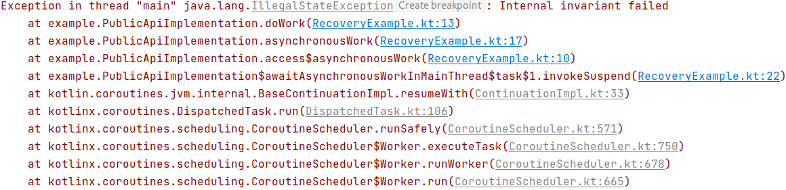
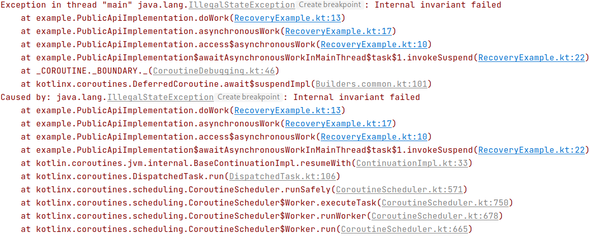

**Table of contents**

<!--- TOC -->

* [Debugging coroutines](#debugging-coroutines)
* [Debug mode](#debug-mode)
* [Stacktrace recovery](#stacktrace-recovery)
  * [Stacktrace recovery machinery](#stacktrace-recovery-machinery)
* [Debug agent](#debug-agent)
  * [Debug agent and Android](#debug-agent-and-android)
* [Android optimization](#android-optimization)

<!--- END -->

## Debugging coroutines

Debugging asynchronous programs is challenging, because multiple concurrent coroutines are typically working at the same time.
To help with that, `kotlinx.coroutines` comes with additional features for debugging: debug mode, stacktrace recovery 
and debug agent.

## Debug mode

The first debugging feature of `kotlinx.coroutines` is debug mode.
It can be enabled either by setting system property [DEBUG_PROPERTY_NAME] or by running Java with enabled assertions (`-ea` flag).
The latter is helpful to have debug mode enabled by default in unit tests.

Debug mode attaches a unique [name][CoroutineName] to every launched coroutine.
Coroutine name can be seen in a regular Java debugger, 
in a string representation of the coroutine or in the thread name executing named coroutine. 
Overhead of this feature is negligible and it can be safely turned on by default to simplify logging and diagnostic.

## Stacktrace recovery

Stacktrace recovery is another useful feature of debug mode. It is enabled by default in the debug mode, 
but can be separately disabled by setting `kotlinx.coroutines.stacktrace.recovery` system property to `false`.

Stacktrace recovery tries to stitch asynchronous exception stacktrace with a stacktrace of the receiver by copying it, providing
not only information where an exception was thrown, but also where it was asynchronously rethrown or caught.

It is easy to demonstrate with actual stacktraces of the same program that awaits asynchronous operation in `main` function 
(runnable code is [here](../../kotlinx-coroutines-debug/test/RecoveryExample.kt)):

| Without recovery | With recovery |
| - | - |
|  |  |

The only downside of this approach is losing referential transparency of the exception. 

> Note that suppressed exceptions are not copied and are left intact in the cause
> in order to prevent cycles in the exceptions chain, obscure`[CIRCULAR REFERENCE]` messages
> and even [crashes](https://jira.qos.ch/browse/LOGBACK-1027) in some frameworks

### Stacktrace recovery machinery   

This section explains the inner mechanism of stacktrace recovery and can be skipped.

When an exception is rethrown between coroutines (e.g. through `withContext` or `Deferred.await` boundary), stacktrace recovery
machinery tries to create a copy of the original exception (with the original exception as the cause), then rewrite stacktrace
of the copy with coroutine-related stack frames (using [Throwable.setStackTrace](https://docs.oracle.com/javase/9/docs/api/java/lang/Throwable.html#setStackTrace-java.lang.StackTraceElement:A-)) 
and then throws the resulting exception instead of the original one.

Exception copy logic is straightforward:
  1) If the exception class implements [CopyableThrowable], [CopyableThrowable.createCopy] is used.
     `null` can be returned from `createCopy` to opt-out specific exception from being recovered.
  2) If the exception class has class-specific fields not inherited from Throwable, the exception is not copied.
  3) Otherwise, one of the public exception's constructor is invoked reflectively with an optional `initCause` call.  

## Debug agent

[kotlinx-coroutines-debug](../../kotlinx-coroutines-debug) module provides one of the most powerful debug capabilities in `kotlinx.coroutines`.

This is a separate module with a JVM agent that keeps track of all alive coroutines, introspects and dumps them similar to thread dump command,
additionally enhancing stacktraces with information where coroutine was created.

The full tutorial of how to use debug agent can be found in the corresponding [readme](../../kotlinx-coroutines-debug/README.md).

### Debug agent and Android

Unfortunately, Android runtime does not support Instrument API necessary for `kotlinx-coroutines-debug` to function, triggering `java.lang.NoClassDefFoundError: Failed resolution of: Ljava/lang/management/ManagementFactory;`.

Nevertheless, it will be possible to support debug agent on Android as soon as [GradleAspectJ-Android](https://github.com/Archinamon/android-gradle-aspectj)  will support android-gradle 3.3 

<!---
Make an exception googlable
java.lang.NoClassDefFoundError: Failed resolution of: Ljava/lang/management/ManagementFactory;
        at kotlinx.coroutines.repackaged.net.bytebuddy.agent.ByteBuddyAgent$ProcessProvider$ForCurrentVm$ForLegacyVm.resolve(ByteBuddyAgent.java:1055)
        at kotlinx.coroutines.repackaged.net.bytebuddy.agent.ByteBuddyAgent$ProcessProvider$ForCurrentVm.resolve(ByteBuddyAgent.java:1038)
        at kotlinx.coroutines.repackaged.net.bytebuddy.agent.ByteBuddyAgent.install(ByteBuddyAgent.java:374)
        at kotlinx.coroutines.repackaged.net.bytebuddy.agent.ByteBuddyAgent.install(ByteBuddyAgent.java:342)
        at kotlinx.coroutines.repackaged.net.bytebuddy.agent.ByteBuddyAgent.install(ByteBuddyAgent.java:328)
        at kotlinx.coroutines.debug.internal.DebugProbesImpl.install(DebugProbesImpl.kt:39)
        at kotlinx.coroutines.debug.DebugProbes.install(DebugProbes.kt:49)
-->

## Android optimization

In optimized (release) builds with R8 version 1.6.0 or later both 
[Debugging mode](../../docs/debugging.md#debug-mode) and 
[Stacktrace recovery](../../docs/debugging.md#stacktrace-recovery) 
are permanently turned off. 
For more details see ["Optimization" section for Android](../../ui/kotlinx-coroutines-android/README.md#optimization). 

<!--- MODULE kotlinx-coroutines-core -->
<!--- INDEX kotlinx.coroutines -->

[DEBUG_PROPERTY_NAME]: https://kotlin.github.io/kotlinx.coroutines/kotlinx-coroutines-core/kotlinx.coroutines/-d-e-b-u-g_-p-r-o-p-e-r-t-y_-n-a-m-e.html
[CoroutineName]: https://kotlin.github.io/kotlinx.coroutines/kotlinx-coroutines-core/kotlinx.coroutines/-coroutine-name/index.html
[CopyableThrowable]: https://kotlin.github.io/kotlinx.coroutines/kotlinx-coroutines-core/kotlinx.coroutines/-copyable-throwable/index.html
[CopyableThrowable.createCopy]: https://kotlin.github.io/kotlinx.coroutines/kotlinx-coroutines-core/kotlinx.coroutines/-copyable-throwable/create-copy.html

<!--- MODULE kotlinx-coroutines-debug -->
<!--- END -->
