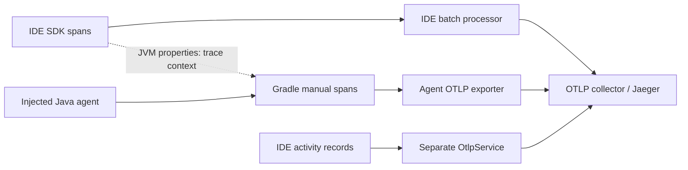

# Spans, transport and timing interpretation

[Capture recipe](collection.md) · [Work inventory](../pipeline/work-inventory.md) · [Source map](../reference/sources.md)

## Useful source-backed names

These names are search hints from the inspected revision, not promises that every installed build emits them or that the existing benchmark files contain them.

| Span / scope | What it encloses | Interpretation trap |
| --- | --- | --- |
| `ExternalSystemSyncProjectTask` | External-system sync task orchestration | Not necessarily indexing/editor-readiness completion |
| `ExternalSystemSyncResultProcessing` | Result handling/import path | Distinct from Gradle execution |
| `GradleExecution` | Resolver-side Gradle execution setup/operation | Includes client-side orchestration |
| `GradleConnection` | Connection acquisition **and supplied operation** | Not a connection-establishment-only timer |
| `GetModel` + `modelClass` | Tooling API model request, e.g. `BuildEnvironment` | Multiple model classes are not duplicated requests |
| `GradleCall` | Action execution and IDE event collection | Can overlap IDE phase contributors; not pure daemon CPU/time |
| `ProjectImportAction`, `InitAction`, `ExecuteAction` | Daemon model-fetch action and its parts | Not synonyms for Gradle's formal lifecycle phases |
| `SerializeGradleModel` | Model conversion serialization attempt | Can overlap production; phase drains may wait for its worker |
| `${phase.name}-idea` | IDE contributor phase work | Multiple phases may update Workspace Model |
| `GradleProjectResolverDataProcessing` | Hierarchy extraction and DataNode conversion | Does not include all later data-service commit work |
| `kotlin_import_jvm_createModule` | Kotlin JVM resolver's module path | Does not measure all KGP configuration/argument work |
| `WorkspaceModelApply` | Models-provider commit in project-change action | Not all conversion, import services or indexing |
| `GradleDaemon` | Instrumentation tracer name | A tracer name is not necessarily Jaeger's service name |

Locations: [E01, E04–E06, E08–E12, T1](../reference/sources.md). Builder textual timing controlled by `idea.gradle.custom.tooling.perf` is a different diagnostic path, not equivalent to OTel spans.

## Export topology

The IDE SDK uses W3C context propagation and HTTP/protobuf export. The execution extension passes `-javaagent`, an agent properties file, `otel.trace.context` and `otel.service.name` to Gradle. Agent configuration selects OTLP and the normalized endpoint; it does not explicitly set the protocol, whose effective default belongs to agent 2.8.0. This is independent of Tooling API model serialization ([T02–T15](../reference/sources.md)).

The configured agent enables OpenTelemetry API and RMI instrumentation. Omitted metrics/instrumentation settings are not explicit disable switches. No daemon JSON destination is requested by this Gradle extension, although the shared configuration helper supports one.

## Flushing is not one global barrier

| Path | Verified behavior | Limit |
| --- | --- | --- |
| IDE SDK `BatchSpanProcessor` | Sampled ended spans enter unlimited queue; default batch 512; one-minute inactivity timeout; export then flush | Continuous arrivals can postpone timeout; export failures are logged, not proof of durable delivery |
| IDE explicit flush/shutdown | Coroutine `flush()` drains/exports/flushes; `forceShutdown()` drains during cancellation and shuts exporters down | SDK-interface `forceFlush()` is unsupported and `shutdown()` is a no-op success; do not invoke those as a generic solution |
| IDE exporter timeouts | 30 s per export attempt; 10 s per exporter flush | Limits, not measured times. Manager's `forceFlushMetrics()` also requests span flush under a 10 s timeout |
| IDE activity `OtlpService` | Separate unlimited activity queue, five-minute inactivity timeout, export on stop/cancellation | Source uses `counter++ >= 512`, so its count trigger is the 513th activity, not the SDK batch rule |
| Gradle manual spans | Span ends in `finally`; parent context is extracted from JVM properties | `GradleOpenTelemetry.shutdown()` closes only the context scope, not the SDK/exporter |
| Gradle Java agent | Direct OTLP export configured | Exact buffering, shutdown delivery and per-sync flushing are not established by this source audit |

Queue closure can drop later-ending spans; exporter failures can lose attempted batches. Neither “sync completed,” “span ended,” nor “flush returned” is proof that Jaeger stored a complete trace. Inspect collector/IDE/daemon errors and actual received roots/children ([T13–T17](../reference/sources.md)).

## Rules for an honest swimlane

1. Preserve trace/span/parent IDs, process/service identity, attributes, events, status and original timestamp units. A shared machine helps clock alignment but does not prove zero skew; validate parent/child timing and any remote target clocks.
2. Wall time is `end − start`. CPU samples sum across threads and can exceed wall time; waiting spans consume wall time without corresponding CPU.
3. Do not sum nested or overlapping spans. For a parent, exclusive elapsed coverage is its interval minus the **union** of child intervals clipped to it, not parent duration minus the sum of child durations.
4. Even correctly computed exclusive times across parallel processes are not necessarily an additive partition of end-to-end latency. Critical-path analysis needs dependency edges and wait relationships, not simply the longest bars.
5. Do not label a pre-`Run build` gap “daemon startup” without process/connection evidence; distribution, environment probes, locks and client work may contribute.
6. Compare like-for-like cache states, source revisions, instrumentation and timing boundaries. The current benchmark's IDE/Gradle buckets cannot populate fine-grained work durations.
7. Unknown or uninstrumented work stays **unknown**, never zero. Retain failed/incomplete runs and report missing coverage rather than fabricating a complete timeline.