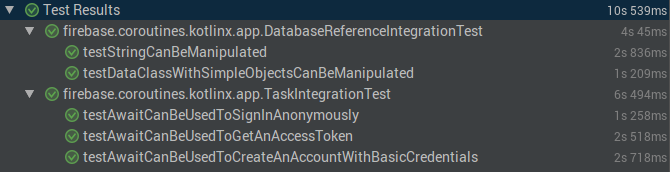

# Module kotlinx-coroutines-firebase

Integration with Firebase [Task](https://developers.google.com/android/reference/com/google/android/gms/tasks/Task) and [DatabaseReference](https://firebase.google.com/docs/reference/android/com/google/firebase/database/DatabaseReference) for Android.

Extension functions:

| **Name** | **Description**
| -------- | ---------------
| [Task.await][com.google.android.gms.tasks.Task.await] | Awaits for completion of the Task and return the result
| [DatabaseReference.readValue][com.google.firebase.database.DatabaseReference.readValue] | Awaits for a single value to be retrieved from Firebase Database
| [DatabaseReference.readList][com.google.firebase.database.DatabaseReference.readList] | Awaits for a List of values to be retrieved from Firebase Database

## Example

### Working with Firebase Authentication

The following code shows how to get an user from Firebase and delete it using two approaches.

The standard approach is to write nested callback functions.

```kotlin
val auth = FirebaseAuth.getInstance()

auth.getUserByEmail(email)
    .addOnSuccessListener { user ->
        auth.deleteUser(user.uid)
            .addOnSuccesListener { println("User deleted") }
            .addOnFailureListener { exception -> println(exception) }
    }
    .addOnFailureListener { exception -> println(exception) }
```

The other approach is the use of a `suspended coroutine` to make the code flatter, so we can call the `await()` method
to wait the first asyncronous operations (retrieve the user) to complete before starting the second one (delete the user).

```kotlin
val auth = FirebaseAuth.getInstance()

try {
  val user = auth.getUserByEmail(email).await()

  auth.deleteUser(user.uid).await()

  println("User deleted")
} catch (exception: FirebaseAuthException) {
  println(exception)
}
```

### Working with Firebase Database

Another usage of this module is to access nodes from a Firebase Database instance.

There are two `suspend functions` that encapsulate callbacks: `readValue` and `readList`.

The usage of both methods can be seen in the code below. It shows how to read a a single value using `readValue`
 to read the player name and `readList` function to read his/her last five points in the game. 

```kotlin
val database = FirebaseDatabase.getInstance()
val gameNode = database.getReference("game")
 
val person = gameNode.child("player").readValue<String>()
val scores = gameNode.child("scores").readList<Int>()
 
println("Scores of $person")
scores.forEach(::println)
```

It's important to mention that since this modules exposes coroutines, 
they must be run inside a context like `launch {}`, `async {}` or `runBlocking` for testing purpose.

### Test results



# Package kotlinx.coroutines.firebase.android

Integration with Firebase [Task](https://developers.google.com/android/reference/com/google/android/gms/tasks/Task) and [DatabaseReference](https://firebase.google.com/docs/reference/android/com/google/firebase/database/DatabaseReference) for Android.

<!--- MODULE kotlinx-coroutines-core -->
<!--- INDEX kotlinx.coroutines.firebase.android -->
[com.google.android.gms.tasks.Task.await]: https://kotlin.github.io/kotlinx.coroutines/kotlinx-coroutines-guava/kotlinx.coroutines.experimental.guava/kotlinx.coroutines.experimental.-deferred/as-listenable-future.html
[com.google.firebase.database.DatabaseReference.readValue]: https://kotlin.github.io/kotlinx.coroutines/kotlinx-coroutines-firebase/kotlinx.coroutines.experimental.firebase.android/com.google.common.util.concurrent.-listenable-future/index.html
[com.google.firebase.database.DatabaseReference.readList]: https://kotlin.github.io/kotlinx.coroutines/kotlinx-coroutines-guava/kotlinx.coroutines.experimental.guava/com.google.common.util.concurrent.-listenable-future/await.html
<!--- END -->
