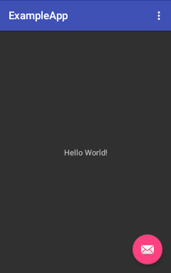

# Guide to UI programming with coroutines

This guide assumes familiarity with basic coroutine concepts that are 
covered in [Guide to kotlinx.coroutines](../docs/coroutines-guide.md) and gives specific 
examples on how to use coroutines in UI applications. 

All UI application libraries have one thing in common. They have the single main thread where all state of the UI 
is confined, and all updates to the UI has to happen in this particular thread. With respect to coroutines, 
it means that you need an appropriate _coroutine dispatcher context_ that confines the coroutine 
execution to this main UI thread. 

In particular, `kotlinx.coroutines` has three modules that provide coroutine context for 
different UI application libraries:
 
* [kotlinx-coroutines-android](kotlinx-coroutines-android) -- `Dispatchers.Main` context for Android applications.
* [kotlinx-coroutines-javafx](kotlinx-coroutines-javafx) -- `Dispatchers.JavaFx` context for JavaFX UI applications.
* [kotlinx-coroutines-swing](kotlinx-coroutines-swing) -- `Dispatchers.Swing` context for Swing UI applications.

Also, UI dispatcher is available via `Dispatchers.Main` from `kotlinx-coroutines-core` and corresponding 
implementation (Android, JavaFx or Swing) is discovered by [`ServiceLoader`](https://docs.oracle.com/javase/8/docs/api/java/util/ServiceLoader.html) API.
For example, if you are writing JavaFx application, you can use either `Dispatchers.Main` or `Dispachers.JavaFx` extension, it will be the same object.

This guide covers all UI libraries simultaneously, because each of these modules consists of just one
object definition that is a couple of pages long. You can use any of them as an example to write the corresponding
context object for your favourite UI library, even if it is not included out of the box here.

## Table of contents

<!--- TOC -->

* [Setup](#setup)
  * [JavaFx](#javafx)
  * [Android](#android)
* [Basic UI coroutines](#basic-ui-coroutines)
  * [Launch UI coroutine](#launch-ui-coroutine)
  * [Cancel UI coroutine](#cancel-ui-coroutine)
* [Using actors within UI context](#using-actors-within-ui-context)
  * [Extensions for coroutines](#extensions-for-coroutines)
  * [At most one concurrent job](#at-most-one-concurrent-job)
  * [Event conflation](#event-conflation)
* [Blocking operations](#blocking-operations)
  * [The problem of UI freezes](#the-problem-of-ui-freezes)
  * [Structured concurrency, lifecycle and coroutine parent-child hierarchy](#structured-concurrency-lifecycle-and-coroutine-parent-child-hierarchy)
  * [Blocking operations](#blocking-operations)
* [Advanced topics](#advanced-topics)
  * [Starting coroutine in UI event handlers without dispatch](#starting-coroutine-in-ui-event-handlers-without-dispatch)

<!--- END -->

## Setup

The runnable examples in this guide are presented for JavaFx. The advantage is that all the examples can 
be directly started on any OS without the need for emulators or anything like that and they are fully self-contained
(each example is in one file). 
There are separate notes on what changes need to be made (if any) to reproduce them on Android. 

### JavaFx

The basic example application for JavaFx consists of a window with a text label named `hello` that initially
contains "Hello World!" string and a pinkish circle in the bottom-right corner named `fab` (floating action button).


The `start` function of JavaFX application invokes `setup` function, passing it reference to `hello` and `fab`
nodes. That is where various code is placed in the rest of this guide:

```kotlin
fun setup(hello: Text, fab: Circle) {
    // placeholder
}
```

> You can get the full code [here](kotlinx-coroutines-javafx/test/guide/example-ui-basic-01.kt).

You can clone [kotlinx.coroutines](https://github.com/Kotlin/kotlinx.coroutines) project from GitHub onto your 
workstation and open the project in IDE. All the examples from this guide are in the test folder of 
[`ui/kotlinx-coroutines-javafx`](kotlinx-coroutines-javafx) module. 
This way you'll be able to run and see how each example works and to 
experiment with them by making changes.

### Android

Follow the guide on [Getting Started With Android and Kotlin](https://kotlinlang.org/docs/tutorials/kotlin-android.html)
to create Kotlin project in Android Studio. You are also encouraged to add 
[Kotlin Android Extensions](https://kotlinlang.org/docs/tutorials/android-plugin.html)
to your application.

In Android Studio 2.3 you'll get an application that looks similarly to the one shown below:



Go to the `context_main.xml` of your application and assign an ID of "hello" to the text view with "Hello World!" string,
so that it is available in your application as `hello` with Kotlin Android extensions. The pinkish floating
action button is already named `fab` in the project template that gets created.

In the `MainActivity.kt` of your application remove the block `fab.setOnClickListener { ... }` and instead
add `setup(hello, fab)` invocation as the last line of `onCreate` function.
Create a placeholder `setup` function at the end of the file. 
That is where various code is placed in the rest of this guide:

```kotlin
fun setup(hello: TextView, fab: FloatingActionButton) {
    // placeholder
}
```

<!--- CLEAR -->

Add dependencies on `kotlinx-coroutines-android` module to the `dependencies { ... }` section of
`app/build.gradle` file:

```groovy
implementation "org.jetbrains.kotlinx:kotlinx-coroutines-android:1.4.0"
```

You can clone [kotlinx.coroutines](https://github.com/Kotlin/kotlinx.coroutines) project from GitHub onto your 
workstation. The resulting template project for Android resides in 
[`ui/kotlinx-coroutines-android/example-app`](kotlinx-coroutines-android/example-app) directory. 
You can load it in Android Studio to follow this guide on Android.

## Basic UI coroutines

This section shows basic usage of coroutines in UI applications.

### Launch UI coroutine

The `kotlinx-coroutines-javafx` module contains 
[Dispatchers.JavaFx][kotlinx.coroutines.Dispatchers.JavaFx] 
dispatcher that dispatches coroutine execution to
the JavaFx application thread. We import it as `Main` to make all the presented examples 
easily portable to Android:
 
```kotlin
import kotlinx.coroutines.javafx.JavaFx as Main
```
 
<!--- CLEAR -->

Coroutines confined to the main UI thread can freely update anything in UI and suspend without blocking the main thread.
For example, we can perform animations by coding them in imperative style. The following code updates the
text with a 10 to 1 countdown twice a second, using [launch] coroutine builder:

```kotlin
fun setup(hello: Text, fab: Circle) {
    GlobalScope.launch(Dispatchers.Main) { // launch coroutine in the main thread
        for (i in 10 downTo 1) { // countdown from 10 to 1 
            hello.text = "Countdown $i ..." // update text
            delay(500) // wait half a second
        }
        hello.text = "Done!"
    }
}
```

> You can get the full code [here](kotlinx-coroutines-javafx/test/guide/example-ui-basic-02.kt).

So, what happens here? Because we are launching coroutine in the main UI context, we can freely update UI from 
inside this coroutine and invoke _suspending functions_ like [delay] at the same time. UI is not frozen
while `delay` waits, because it does not block the UI thread -- it just suspends the coroutine.

> The corresponding code for Android application is the same. 
  You just need to copy the body of `setup` function into the corresponding function of Android project. 

### Cancel UI coroutine

We can keep a reference to the [Job] object that `launch` function returns and use it to cancel
coroutine when we want to stop it. Let us cancel the coroutine when pinkish circle is clicked:

```kotlin
fun setup(hello: Text, fab: Circle) {
    val job = GlobalScope.launch(Dispatchers.Main) { // launch coroutine in the main thread
        for (i in 10 downTo 1) { // countdown from 10 to 1 
            hello.text = "Countdown $i ..." // update text
            delay(500) // wait half a second
        }
        hello.text = "Done!"
    }
    fab.onMouseClicked = EventHandler { job.cancel() } // cancel coroutine on click
}
```

> You can get the full code [here](kotlinx-coroutines-javafx/test/guide/example-ui-basic-03.kt).

Now, if the circle is clicked while countdown is still running, the countdown stops. 
Note that [Job.cancel] is completely thread-safe and non-blocking. It just signals the coroutine to cancel 
its job, without waiting for it to actually terminate. It can be invoked from anywhere.
Invoking it on a coroutine that was already cancelled or has completed does nothing. 

> The corresponding line for Android is shown below: 

```kotlin
fab.setOnClickListener { job.cancel() }  // cancel coroutine on click
```

<!--- CLEAR -->

## Using actors within UI context

In this section we show how UI applications can use actors within their UI context make sure that 
there is no unbounded growth in the number of launched coroutines.

### Extensions for coroutines

Our goal is to write an extension _coroutine builder_ function named `onClick`, 
so that we can perform countdown animation every time when the circle is clicked with this simple code:

```kotlin
fun setup(hello: Text, fab: Circle) {
    fab.onClick { // start coroutine when the circle is clicked
        for (i in 10 downTo 1) { // countdown from 10 to 1 
            hello.text = "Countdown $i ..." // update text
            delay(500) // wait half a second
        }
        hello.text = "Done!"
    }
}
```

<!--- INCLUDE .*/example-ui-actor-([0-9]+).kt -->

Our first implementation for `onClick` just launches a new coroutine on each mouse event and
passes the corresponding mouse event into the supplied action (just in case we need it):

```kotlin
fun Node.onClick(action: suspend (MouseEvent) -> Unit) {
    onMouseClicked = EventHandler { event ->
        GlobalScope.launch(Dispatchers.Main) { 
            action(event)
        }
    }
}
```  

> You can get the full code [here](kotlinx-coroutines-javafx/test/guide/example-ui-actor-01.kt).

Note that each time the circle is clicked, it starts a new coroutine and they all compete to 
update the text. Try it. It does not look very good. We'll fix it later.

> On Android, the corresponding extension can be written for `View` class, so that the code
  in `setup` function that is shown above can be used without changes. There is no `MouseEvent`
  used in OnClickListener on Android, so it is omitted.

```kotlin
fun View.onClick(action: suspend () -> Unit) {
    setOnClickListener { 
        GlobalScope.launch(Dispatchers.Main) {
            action()
        }
    }
}
```

<!--- CLEAR -->

### At most one concurrent job

We can cancel an active job before starting a new one to ensure that at most one coroutine is animating 
the countdown. However, it is generally not the best idea. The [cancel][Job.cancel] function serves only as a signal
to abort a coroutine. Cancellation is cooperative and a coroutine may, at the moment, be doing something non-cancellable
or otherwise ignore a cancellation signal. A better solution is to use an [actor] for tasks that should
not be performed concurrently. Let us change `onClick` extension implementation:
  
```kotlin
fun Node.onClick(action: suspend (MouseEvent) -> Unit) {
    // launch one actor to handle all events on this node
    val eventActor = GlobalScope.actor<MouseEvent>(Dispatchers.Main) {
        for (event in channel) action(event) // pass event to action
    }
    // install a listener to offer events to this actor
    onMouseClicked = EventHandler { event ->
        eventActor.offer(event)
    }
}
```  

> You can get the full code [here](kotlinx-coroutines-javafx/test/guide/example-ui-actor-02.kt).
  
The key idea that underlies an integration of an actor coroutine and a regular event handler is that 
there is an [offer][SendChannel.offer] function on [SendChannel] that does not wait. It sends an element to the actor immediately,
if it is possible, or discards an element otherwise. An `offer` actually returns a `Boolean` result which we ignore here.

Try clicking repeatedly on a circle in this version of the code. The clicks are just ignored while the countdown 
animation is running. This happens because the actor is busy with an animation and does not receive from its channel.
By default, an actor's mailbox is backed by `RendezvousChannel`, whose `offer` operation succeeds only when 
the `receive` is active. 

> On Android, there is `View` sent in OnClickListener, so we send the `View` to the actor as a signal. 
  The corresponding extension for `View` class looks like this:

```kotlin
fun View.onClick(action: suspend (View) -> Unit) {
    // launch one actor
    val eventActor = GlobalScope.actor<View>(Dispatchers.Main) {
        for (event in channel) action(event)
    }
    // install a listener to activate this actor
    setOnClickListener { 
        eventActor.offer(it)
    }
}
```

<!--- CLEAR -->


### Event conflation
 
Sometimes it is more appropriate to process the most recent event, instead of just ignoring events while we were busy
processing the previous one.  The [actor] coroutine builder accepts an optional `capacity` parameter that 
controls the implementation of the channel that this actor is using for its mailbox. The description of all 
the available choices is given in documentation of the [`Channel()`][Channel] factory function.

Let us change the code to use a conflated channel by passing [Channel.CONFLATED] capacity value. The 
change is only to the line that creates an actor:

```kotlin
fun Node.onClick(action: suspend (MouseEvent) -> Unit) {
    // launch one actor to handle all events on this node
    val eventActor = GlobalScope.actor<MouseEvent>(Dispatchers.Main, capacity = Channel.CONFLATED) { // <--- Changed here
        for (event in channel) action(event) // pass event to action
    }
    // install a listener to offer events to this actor
    onMouseClicked = EventHandler { event ->
        eventActor.offer(event)
    }
}
```  

> You can get full JavaFx code [here](kotlinx-coroutines-javafx/test/guide/example-ui-actor-03.kt).
  On Android you need to update `val eventActor = ...` line from the previous example. 

Now, if a circle is clicked while the animation is running, it restarts animation after the end of it. Just once. 
Repeated clicks while the animation is running are _conflated_ and only the most recent event gets to be 
processed. 

This is also a desired behaviour for UI applications that have to react to incoming high-frequency
event streams by updating their UI based on the most recently received update. A coroutine that is using
`ConflatedChannel` avoids delays that are usually introduced by buffering of events.

You can experiment with `capacity` parameter in the above line to see how it affects the behaviour of the code.
Setting `capacity = Channel.UNLIMITED` creates a coroutine with `LinkedListChannel` mailbox that buffers all 
events. In this case, the animation runs as many times as the circle is clicked.

## Blocking operations

This section explains how to use UI coroutines with thread-blocking operations.

### The problem of UI freezes 

It would have been great if all APIs out there were written as suspending functions that never blocks an 
execution thread. However, it is quite often not the case. Sometimes you need to do a CPU-consuming computation
or just need to invoke some 3rd party APIs for network access, for example, that blocks the invoker thread. 
You cannot do that from the main UI thread nor from the UI-confined coroutine directly, because that would
block the main UI thread and cause the freeze up of the UI.

<!--- INCLUDE .*/example-ui-blocking-([0-9]+).kt
fun Node.onClick(action: suspend (MouseEvent) -> Unit) {
    val eventActor = GlobalScope.actor<MouseEvent>(Dispatchers.Main, capacity = Channel.CONFLATED) {
        for (event in channel) action(event) // pass event to action
    }
    onMouseClicked = EventHandler { event ->
        eventActor.offer(event)
    }
}
-->

The following example illustrates the problem. We are going to use `onClick` extension with UI-confined
event-conflating actor from the last section to process the last click in the main UI thread. 
For this example, we are going to 
perform naive computation of [Fibonacci numbers](https://en.wikipedia.org/wiki/Fibonacci_number):
 
```kotlin
fun fib(x: Int): Int =
    if (x <= 1) x else fib(x - 1) + fib(x - 2)
``` 
 
We'll be computing larger and larger Fibonacci number each time the circle is clicked. 
To make the UI freeze more obvious, there is also a fast counting animation that is always running 
and is constantly updating the text in the main UI dispatcher:

```kotlin
fun setup(hello: Text, fab: Circle) {
    var result = "none" // the last result
    // counting animation 
    GlobalScope.launch(Dispatchers.Main) {
        var counter = 0
        while (true) {
            hello.text = "${++counter}: $result"
            delay(100) // update the text every 100ms
        }
    }
    // compute the next fibonacci number of each click
    var x = 1
    fab.onClick {
        result = "fib($x) = ${fib(x)}"
        x++
    }
}
```
 
> You can get full JavaFx code [here](kotlinx-coroutines-javafx/test/guide/example-ui-blocking-01.kt).
  You can just copy the `fib` function and the body of the `setup` function to your Android project.

Try clicking on the circle in this example. After around 30-40th click our naive computation is going to become
quite slow and you would immediately see how the main UI thread freezes, because the animation stops running 
during UI freeze.

### Structured concurrency, lifecycle and coroutine parent-child hierarchy

A typical UI application has a number of elements with a lifecycle. Windows, UI controls, activities, views, fragments
and other visual elements are created and destroyed. A long-running coroutine, performing some IO or a background
computation, can retain references to the corresponding UI elements for longer than it is needed, preventing garbage
collection of the whole trees of UI objects that were already destroyed and will not be displayed anymore.

The natural solution to this problem is to associate a [CoroutineScope] object with each UI object that has a
lifecycle and create all the coroutines in the context of this scope.
For the sake of simplicity, [MainScope()] factory can be used. It automatically provides `Dispatchers.Main` and
a parent job for all the children coroutines.

For example, in Android application an `Activity` is initially _created_ and is _destroyed_ when it is no longer
needed and when its memory must be released. A natural solution is to attach an
instance of a `CoroutineScope` to an instance of an `Activity`:

<!--- CLEAR -->

```kotlin
class MainActivity : AppCompatActivity() {
    private val scope = MainScope()

    override fun onDestroy() {
        super.onDestroy()
        scope.cancel()
    } 

    fun asyncShowData() = scope.launch { // Is invoked in UI context with Activity's scope as a parent
        // actual implementation
    }
    
    suspend fun showIOData() {
        val data = withContext(Dispatchers.IO) {
            // compute data in background thread      
        }
        withContext(Dispatchers.Main) {
            // Show data in UI
        }
    }
}
```

Every coroutine launched from within a `MainActivity` has its job as a parent and is immediately cancelled when
activity is destroyed.

> Note, that Android has first-party support for coroutine scope in all entities with the lifecycle.
See [the corresponding documentation](https://developer.android.com/topic/libraries/architecture/coroutines#lifecyclescope).

Parent-child relation between jobs forms a hierarchy. A coroutine that performs some background job on behalf of
the activity can create further children coroutines. The whole tree of coroutines gets cancelled
when the parent job is cancelled. An example of that is shown in the
["Children of a coroutine"](../docs/coroutine-context-and-dispatchers.md#children-of-a-coroutine) section of the guide to coroutines.

<!--- CLEAR -->

### Blocking operations

The fix for the blocking operations on the main UI thread is quite straightforward with coroutines. We'll 
convert our "blocking" `fib` function to a non-blocking suspending function that runs the computation in 
the background thread by using [withContext] function to change its execution context to [Dispatchers.Default] that is 
backed by the background pool of threads. 
Notice, that `fib` function is now marked with `suspend` modifier. It does not block the coroutine that
it is invoked from anymore, but suspends its execution when the computation in the background thread is working:

<!--- INCLUDE .*/example-ui-blocking-0[23].kt

fun setup(hello: Text, fab: Circle) {
    var result = "none" // the last result
    // counting animation 
    GlobalScope.launch(Dispatchers.Main) {
        var counter = 0
        while (true) {
            hello.text = "${++counter}: $result"
            delay(100) // update the text every 100ms
        }
    }
    // compute next fibonacci number of each click
    var x = 1
    fab.onClick {
        result = "fib($x) = ${fib(x)}"
        x++
    }
}
-->

```kotlin
suspend fun fib(x: Int): Int = withContext(Dispatchers.Default) {
    if (x <= 1) x else fib(x - 1) + fib(x - 2)
}
```

> You can get the full code [here](kotlinx-coroutines-javafx/test/guide/example-ui-blocking-02.kt).

You can run this code and verify that UI is not frozen while large Fibonacci numbers are being computed. 
However, this code computes `fib` somewhat slower, because every recursive call to `fib` goes via `withContext`. This is 
not a big problem in practice, because `withContext` is smart enough to check that the coroutine is already running
in the required context and avoids overhead of dispatching coroutine to a different thread again. It is an 
overhead nonetheless, which is visible on this primitive code that does nothing else, but only adds integers 
in between invocations to `withContext`. For some more substantial code, the overhead of an extra `withContext` invocation is 
not going to be significant.

Still, this particular `fib` implementation can be made to run as fast as before, but in the background thread, by renaming
the original `fib` function to `fibBlocking` and defining `fib` with `withContext` wrapper on top of `fibBlocking`:

```kotlin
suspend fun fib(x: Int): Int = withContext(Dispatchers.Default) {
    fibBlocking(x)
}

fun fibBlocking(x: Int): Int = 
    if (x <= 1) x else fibBlocking(x - 1) + fibBlocking(x - 2)
```

> You can get the full code [here](kotlinx-coroutines-javafx/test/guide/example-ui-blocking-03.kt).

You can now enjoy full-speed naive Fibonacci computation without blocking the main UI thread. 
All we need is `withContext(Dispatchers.Default)`.

Note that because the `fib` function is invoked from the single actor in our code, there is at most one concurrent 
computation of it at any given time, so this code has a natural limit on the resource utilization. 
It can saturate at most one CPU core.
  
## Advanced topics

This section covers various advanced topics. 

### Starting coroutine in UI event handlers without dispatch

Let us write the following code in `setup` to visualize the order of execution when coroutine is launched
from the UI thread:

<!--- CLEAR -->

```kotlin
fun setup(hello: Text, fab: Circle) {
    fab.onMouseClicked = EventHandler {
        println("Before launch")
        GlobalScope.launch(Dispatchers.Main) {
            println("Inside coroutine")
            delay(100)
            println("After delay")
        } 
        println("After launch")
    }
}
```
 
> You can get full JavaFx code [here](kotlinx-coroutines-javafx/test/guide/example-ui-advanced-01.kt).

When we start this code and click on a pinkish circle, the following messages are printed to the console:
 
```text
Before launch
After launch
Inside coroutine
After delay
```

As you can see, execution immediately continues after [launch], while the coroutine gets posted onto the main UI thread
for execution later. All UI dispatchers in `kotlinx.coroutines` are implemented this way. Why so? 

Basically, the choice here is between "JS-style" asynchronous approach (async actions
are always postponed to be executed later in the event dispatch thread) and "C#-style" approach
(async actions are executed in the invoker thread until the first suspension point).
While, C# approach seems to be more efficient, it ends up with recommendations like
"use `yield` if you need to ....". This is error-prone. JS-style approach is more consistent
and does not require programmers to think about whether they need to yield or not.

However, in this particular case when coroutine is started from an event handler and there is no other code around it,
this extra dispatch does indeed add an extra overhead without bringing any additional value. 
In this case an optional [CoroutineStart] parameter to [launch], [async] and [actor] coroutine builders 
can be used for performance optimization. 
Setting it to the value of [CoroutineStart.UNDISPATCHED] has the effect of starting to execute
coroutine immediately until its first suspension point as the following example shows:

```kotlin
fun setup(hello: Text, fab: Circle) {
    fab.onMouseClicked = EventHandler {
        println("Before launch")
        GlobalScope.launch(Dispatchers.Main, CoroutineStart.UNDISPATCHED) { // <--- Notice this change
            println("Inside coroutine")
            delay(100)                            // <--- And this is where coroutine suspends      
            println("After delay")
        }
        println("After launch")
    }
}
```
 
> You can get full JavaFx code [here](kotlinx-coroutines-javafx/test/guide/example-ui-advanced-02.kt).

It prints the following messages on click, confirming that code in the coroutine starts to execute immediately:

```text
Before launch
Inside coroutine
After launch
After delay
```
  
<!--- MODULE kotlinx-coroutines-core -->
<!--- INDEX kotlinx.coroutines -->
[launch]: https://kotlin.github.io/kotlinx.coroutines/kotlinx-coroutines-core/kotlinx.coroutines/launch.html
[delay]: https://kotlin.github.io/kotlinx.coroutines/kotlinx-coroutines-core/kotlinx.coroutines/delay.html
[Job]: https://kotlin.github.io/kotlinx.coroutines/kotlinx-coroutines-core/kotlinx.coroutines/-job/index.html
[Job.cancel]: https://kotlin.github.io/kotlinx.coroutines/kotlinx-coroutines-core/kotlinx.coroutines/-job/cancel.html
[CoroutineScope]: https://kotlin.github.io/kotlinx.coroutines/kotlinx-coroutines-core/kotlinx.coroutines/-coroutine-scope/index.html
[MainScope()]: https://kotlin.github.io/kotlinx.coroutines/kotlinx-coroutines-core/kotlinx.coroutines/-main-scope.html
[withContext]: https://kotlin.github.io/kotlinx.coroutines/kotlinx-coroutines-core/kotlinx.coroutines/with-context.html
[Dispatchers.Default]: https://kotlin.github.io/kotlinx.coroutines/kotlinx-coroutines-core/kotlinx.coroutines/-dispatchers/-default.html
[CoroutineStart]: https://kotlin.github.io/kotlinx.coroutines/kotlinx-coroutines-core/kotlinx.coroutines/-coroutine-start/index.html
[async]: https://kotlin.github.io/kotlinx.coroutines/kotlinx-coroutines-core/kotlinx.coroutines/async.html
[CoroutineStart.UNDISPATCHED]: https://kotlin.github.io/kotlinx.coroutines/kotlinx-coroutines-core/kotlinx.coroutines/-coroutine-start/-u-n-d-i-s-p-a-t-c-h-e-d.html
<!--- INDEX kotlinx.coroutines.channels -->
[actor]: https://kotlin.github.io/kotlinx.coroutines/kotlinx-coroutines-core/kotlinx.coroutines.channels/actor.html
[SendChannel.offer]: https://kotlin.github.io/kotlinx.coroutines/kotlinx-coroutines-core/kotlinx.coroutines.channels/-send-channel/offer.html
[SendChannel]: https://kotlin.github.io/kotlinx.coroutines/kotlinx-coroutines-core/kotlinx.coroutines.channels/-send-channel/index.html
[Channel]: https://kotlin.github.io/kotlinx.coroutines/kotlinx-coroutines-core/kotlinx.coroutines.channels/-channel/index.html
[Channel.CONFLATED]: https://kotlin.github.io/kotlinx.coroutines/kotlinx-coroutines-core/kotlinx.coroutines.channels/-channel/-c-o-n-f-l-a-t-e-d.html
<!--- MODULE kotlinx-coroutines-javafx -->
<!--- INDEX kotlinx.coroutines.javafx -->
[kotlinx.coroutines.Dispatchers.JavaFx]: https://kotlin.github.io/kotlinx.coroutines/kotlinx-coroutines-javafx/kotlinx.coroutines.javafx/kotlinx.coroutines.-dispatchers/-java-fx.html
<!--- MODULE kotlinx-coroutines-android -->
<!--- INDEX kotlinx.coroutines.android -->
<!--- END -->
